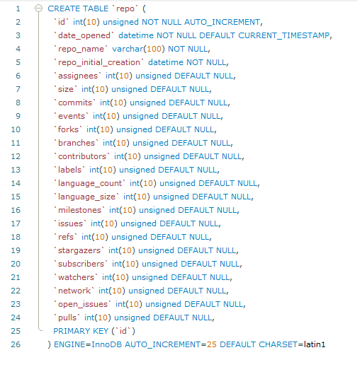
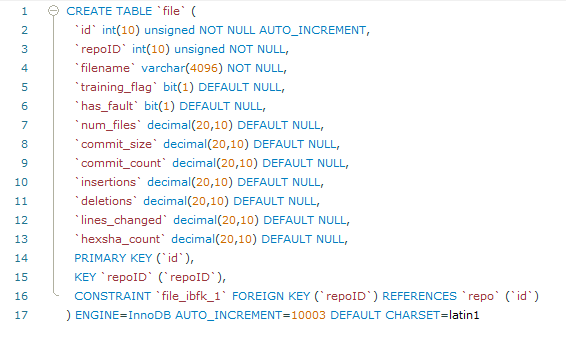

# Data Acquisition
Collects data on github repositories and stores it in a MySQL database.


## Repo Data

"Repo Data" refers to all the data points that we can access through python libraries and using githubs API. What you will notice below is that we have several data points some we use and some we have available if needed.

The sections are broken off based on data types. Our data points consist of Integers, Strings, Datetime, Boolean, and a few list data types. Not all the data points you see are in the program and there are some that are only used for making other points.

##### Integer Data Points

|                 |                  |               |               |
| ----------------|:----------------:| -------------:| -------------:|
| assigneees      | open_issues      | forks         | contributors  |
| branches        | commits          | issues        |               |
| language_count  | milestones       | network_count |               |
| pulls           | refs             | stargazers    |               |
| subscribers     | watchers         | size          |               |
| labels          | language_size    | stargazers    |               |


##### Boolean Data Points

|                 |                  |               |
| ----------------|:----------------:| -------------:|
| has_issue       | has_project      | has_wiki      |
| has_download    |                  |               |

##### List Data Points

These are lists of data points that would have to be iterated through to store the individual values

- Languages
- language_sizes
- stargazer_dates

        languages = [c, py, java] and language_size = [123434, 654356, 654] are just to give you an idea of how they'd be represented.

##### Strings and Datetime Data Points

- date_opened (datetime)
- repo_name (string)
- repo_initial_creation (datetime)


## File Data

"File Data" refers to any data points that are tied in closely with the individual files of a given project. These points have data points tied in with Decimals, Strings, Bits and Integers

##### Decimal Data Points

|               |               |                |
| --------------|:-------------:| --------------:|
| num_files     | commit_count  | insertion      |
| commit_size   | deletion      | lines_changed  |
| Hexsha_count  |               |                |


##### Integer, String and Bit Data Points

- repoID (Integer)
- filename (String)
- training_flag (Bit)
- has_fault (Integer)

##### List Data Points

- committed_datetime 
- files
- commits_hexsha


# Testing

Running Program:
**Everything is done automatically through the script**

**Make sure Path list, token access and config file are in same directory as main program**
```shell script
Python Main.py
```
## Automated Data Collection Method

This Method involves implementing a for loop that reads from a text file all the projects and their directory paths so our program can gather the data on each project that way without the user manually entering that required information each time.

## Automation Method

### Sudo-code

**Automation Method**


## Github Repository Names

Accumulating a list of repo names so we can begin testing shortly, any mention of `cve` in the commmit logs  and issues is what we have been looking for, we are currently looking for as many projects as possible.

Currently we are only able to get the data and run the tests through clonning of the projects, getting the full repo name and using the test directory to pull the data points.

- openssl/openssl
- MontaVista-OpenSourceTechnology/poky
- meiyopeng/guix
- fgeek/pyfiscan
- microsoft/ChakraCore
- libreswan/libreswan
- FriendsOfPHP/security-advisories
- NYULibraries/privileges
- nuxsmin/sysPass
- lantw44m/freebsd-ports-gnome


## Database Schemas

Below are images of our current repo and file database schemas showing which data points are present in the database
for us to insert and use. **Subject to change**

**Repo Schema**



**File Schema**



