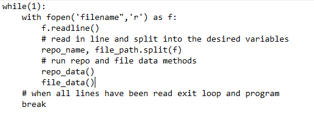

# Data Log

This file contains a detailed list of all the data we are able to collect from the python script we've created. It is
broken down into sections based on how it is stored within our database.

## Repo Data

These are all the data points we are able to obtain regarding the repository itself, this is focused less on the files
but rather on the project as a whole as uploaded on githubs website. The Data is mostly Integer data but we are able to
gather boolean data as well as datetime data.

**In regards to the datetime data minus repo_crated_at variable it is stored in a list and currently we are unable to
store that into the database.**

**Table of Repo data of type Integer** 

| Repo Data       |                  |               |
| ----------------|:----------------:| -------------:|
| assigneees      | count_open_issues| forks         |
| branches        | commits          | issues        |
| language_count  | milestones       | network_count |
| pulls           | refs             | stargazers    |
| subs            | watchers         | size          |
| repo_created_at |                  |               |

**Table of Repo Data of type bool**

| Repo Data       |                  |               |
| ----------------|:----------------:| -------------:|
| has_issue       | has_project      | has_wiki      |
| has_download    |                  |               |

**List of Repo Data of type datetime but in a list**

- stargazer_dates

We also have the type of language used in the project and the size of each languages use. Working on a way to store them
together or most likely they will be seperate data points but they will have to be stored in a list
`ex) lang = [c,py,java] is a string list and lang_size = [123434, 654356, 654] is an integer list.` Note both data
points are more related to the files 

- lang_string
- lang_size

## file data

The file data has been far trickier to obtain and has required several different methods to obtain the current data
points we have. Still working to obtain more data points by other means currently listed below are all the data points
we have that we can pull that correlate more to the files in the project than the github repository.

**Table of all the file data we currently have all integer data except hexsha**

| file Data                  |                        |                             |
| ---------------------------|:----------------------:| ---------------------------:|
| number_of_files_in_project | commit_files_count     | commit_insertion_count      |
| commit_size_sum            | commit_deletion_count  | commit_lines_changed_count  |
| Hexsha                     |                        |                             |

**List of file data of type datetime but in a list**

- committed_datetime (list of datetime)

# Testing

## Methods

Several Ideas are in the work for gathering data automatically especially without constantly having to manually insert
the require info needed to begin the collection process.

**1) Read in from a file**

Store the repository names and the directory paths in separate or the same file and have the program read in each line,
collect and insert the date into the database and repeat the process repeatedly until the entire file has been
read.

## Sudo-code

**Method 1**

## Github Repository Names

Accumilating a list of repo names so we can begin testing shortly, any mention of `cve` in the commmit logs is good
enough, looking for as many projects as possible.

Currently we are only able to get the data and run the tests through clonning of the projects getting the full repo name
and using the test directory to pull the data points. (there are probably way easier ways but we currently don't know
them and this way seems the fastest)

- openssl/openssl
- MontaVista-OpenSourceTechnology/poky
- meiyopeng/guix
- fgeek/pyfiscan
- microsoft/ChakraCore
- libreswan/libreswan
- FriendsOfPHP/security-advisories
- NYULibraries/privileges
- nuxsmin/sysPass
- microsoft
- lantw44m/freebsd-ports-gnome
- raspberrypi/linux

