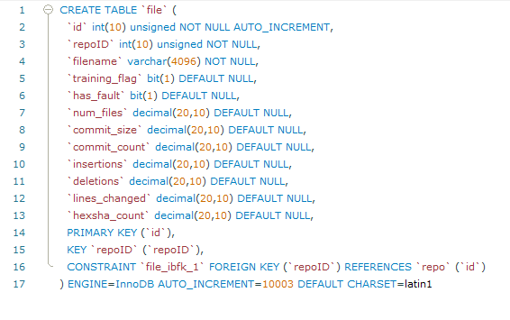

# Data Log

This file contains a detailed list of all the data we are able to collect from the python script we've created. It is
broken down into sections based on how it is stored within our database.

## Repo Data

"Repo Data" refers to all the data points that we can access through python libraries and using githubs API. What you will notice below is that we have several data points some we use and some we have available if we for whatever reason our Machine Learning team requires more points.

The sections are broken off into sections based on data type. Our data points consist of Integers, Strings, Datetime, Boolean, and a few list data types. Not all the data points you see are in the program and there are some that are only used for making other points.

##### Integer Data Points

|                 |                  |               |               |
| ----------------|:----------------:| -------------:| -------------:|
| assigneees      | open_issues      | forks         | contributors  |
| branches        | commits          | issues        |               |
| language_count  | milestones       | network_count |               |
| pulls           | refs             | stargazers    |               |
| subscribers     | watchers         | size          |               |
| labels          | language_size    | stargazers    |               |

##### Boolean Data Points

|                 |                  |               |
| ----------------|:----------------:| -------------:|
| has_issue       | has_project      | has_wiki      |
| has_download    |                  |               |

##### List Data Points

These are lists of data points that would have to be iterated through to store the individual values

- Languages
- language_sizes
- stargazer_dates

        languages = [c, py, java] and language_size = [123434, 654356, 654] are just to give you an idea of how they'd be represented.

##### Strings and Datetime Data Points

- date_opened (datetime)
- repo_name (string)
- repo_initial_creation (datetime)

## File Data

"File Data" refers to any data points that are tied in closely with the individual files and directories of a given project. These points have data points tied in with Decimals, Strings, Bits and Integers

##### Decimal Data Points

|               |               |                |
| --------------|:-------------:| --------------:|
| num_files     | commit_count  | insertion      |
| commit_size   | deletion      | lines_changed  |
| Hexsha_count  |               |                |

##### Integer, String and Bit Data Points

- repoID (Integer)
- filename (String)
- training_flag (Bit)
- has_fault (Bit)

##### List Data Points

- committed_datetime 
- files
- commits_hexsha

# Testing

## Automated Data Collection Method

A Big focus is creating a program that runs automatically where we wou;dn't have to manually input the information required to start up the program each time. Mainly we just don't want to worry about having all of the projects stored and having to manually enter the repositories github name and its cloned directory path over and over again.
So we deced to implement a for loop that reads from a text file all the projects and their directory paths so our program can handle all of the extra labor for us.

## Automation Method

Store the repository names and the directory paths in the same file and have the program read in each line,
collect and insert the date into the database and repeat the process repeatedly until the entire file has been
read.

### Sudo-code

**Automation Method**

## Github Repository Names

Accumulating a list of repo names so we can begin testing shortly, any mention of `cve` in the commmit logs  and issues is what we have been looking for, we are currently looking for as many projects as possible.

Currently we are only able to get the data and run the tests through clonning of the projects, getting the full repo name and using the test directory to pull the data points.

- openssl/openssl
- MontaVista-OpenSourceTechnology/poky
- meiyopeng/guix
- fgeek/pyfiscan
- microsoft/ChakraCore
- libreswan/libreswan
- FriendsOfPHP/security-advisories
- NYULibraries/privileges
- nuxsmin/sysPass
- lantw44m/freebsd-ports-gnome

## Database Schemas

Below are images of our current repo and file database schemas showing which data points are present in the database
for us to insert and use. **Subject to change**

**Repo Schema**

**File Schema**

