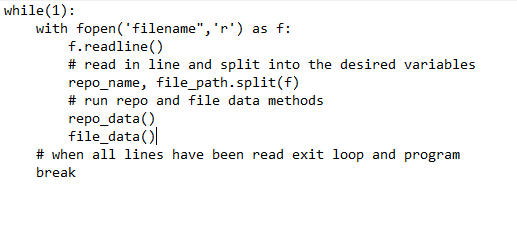
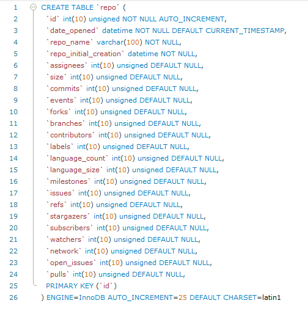
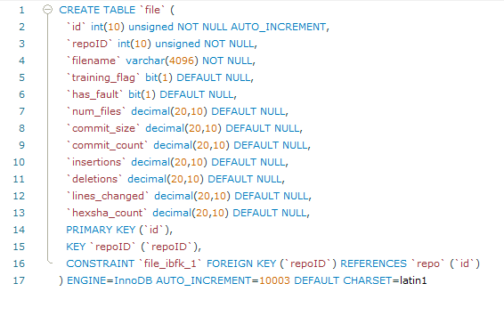

# Probable Vulnerability Security Scanner

Probable Vulnerability Security Scanner or pvSec focuses on gather data points from githubs api as well as taking
data from locally cloned projects. With the data collected from the script it is then sent to a database via a connection
made in the script.

## Data Points

There are 2 forms of data that pvSec gathers, both involve the use of githubs API and both pull information from the
individual repositories both online and locally. The first one is the **Repo Data** which refers to all the data points
that we can that are more inline with what a user could see from github. This includes number of branches, open issues, commits, contributors, forks and the size of the project. 


##### Integer Data Points

|                 |                  |               |               |
| ----------------|:----------------:| -------------:| -------------:|
| assigneees      | open_issues      | forks         | contributors  |
| branches        | commits          | issues        |               |
| language_count  | milestones       | network_count |               |
| pulls           | refs             | stargazers    |               |
| subscribers     | watchers         | size          |               |
| labels          | language_size    | stargazers    |               |

##### List Data Points

These are lists of data points that are used to gather the total amount. The total number of languages, total Language
size and total number of stargazer dates.

- Languages
- language_sizes
- stargazer_dates

        languages = [c, py, java] and language_size = [123434, 654356, 654] are just to give you an idea of how they'd be represented.

##### Strings and Datetime Data Points

- date_opened (datetime)
- repo_name (string)
- repo_initial_creation (datetime)


## File Data

The second type of data collected is the "File Data" which refers to any data points that are tied in closely with the
project locally. This does not have a complete focus on the individual files of a given repo, However it does give me
data points such as number of files, commit size and number of commits.

##### Decimal Data Points

|               |               |                |
| --------------|:-------------:| --------------:|
| num_files     | commit_count  | insertion      |
| commit_size   | deletion      | lines_changed  |
| Hexsha_count  |               |                |


##### Integer, String Data Points

- repoID (Integer)
- filename (String)
- has_fault (Integer)

##### List Data Points

These are lists of data points that are used to gather the total amount. The total number of committed datetimes, the number of files in a project and number of file hexes

- committed_datetime 
- files
- commits_hexsha


# Testing

Running Program:
**Everything is done automatically through the script besides the cloning of projects for training**

```shell script
Python Main.py
```

## Automated Data Collection

This Method involves implementing a for loop that reads from a text file all the projects and their directory paths so our program can gather the data on each project that way without the user does not have to manually enter the required information each time.

### Sudo-code

**Automation Method**



## Github Repository Names

Accumulating a list of repo names so we can begin testing shortly, any mention of `cve` in the commmit logs  and issues is what we have been looking for, we are currently looking for as many projects as possible.

Currently we are only able to get the data and run the tests through clonning of the projects, getting the full repo name and using the test directory to pull the data points.

- openssl/openssl
- MontaVista-OpenSourceTechnology/poky
- meiyopeng/guix
- fgeek/pyfiscan
- microsoft/ChakraCore
- libreswan/libreswan
- FriendsOfPHP/security-advisories
- NYULibraries/privileges
- nuxsmin/sysPass
- lantw44m/freebsd-ports-gnome


## Database Schemas

Below are images of our current repo and file database schemas showing which data points are present in the database
for us to insert and use. **Subject to change**

**Repo Schema**



**File Schema**



